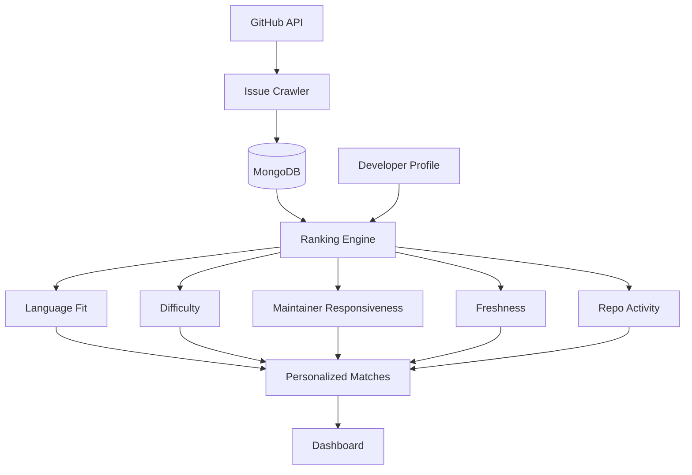

<div align="center">


**Find GitHub issues you can actually merge.**

Personalized open-source issue discovery, ranked by language fit, difficulty, maintainer responsiveness, repo activity, and freshness.

[](https://nextjs.org/)
[](https://www.typescriptlang.org/)
[](https://www.mongodb.com/)
[](#-contributing)

[Live Demo](#) · [Report Bug](../../issues) · [Request Feature](../../issues)


</div>

---

## 📖 Table of Contents

- [Why NextPR?](#-why-nextpr)
- [Features](#-features)
- [How It Works](#-how-it-works)
- [Tech Stack](#-tech-stack)
- [Getting Started](#-getting-started)
- [Environment Variables](#-environment-variables)
- [Project Structure](#-project-structure)
- [Roadmap](#-roadmap)
- [Contributing](#-contributing)
- [License](#-license)

---

## 💡 Why NextPR?

Searching GitHub for a good first issue means scrolling through stale threads, unresponsive maintainers, and tasks far outside your skill set. NextPR does the filtering for you and surfaces issues that are **relevant, recent, and likely to get reviewed**.

---

## ✨ Features

| | Feature | Description |
|---|---|---|
| 🎯 | **Personalized matching** | Issues matched to your languages and experience level |
| 🧠 | **Smart ranking** | Multi-signal scoring: language fit, difficulty, maintainer responsiveness, freshness, repo activity |
| 🔐 | **GitHub OAuth** | Secure sign-in with your GitHub account |
| 🔎 | **Issue discovery** | Browse with filters and sorting |
| ❤️ | **Saved issues** | Bookmark issues and come back later |
| 📊 | **Developer dashboard** | Recommendations tailored to your profile |
| ⚡ | **Fast UI** | Responsive interface built on Next.js |

---

## 🧠 How It Works



1. **Crawl**: the crawler pulls open issues from GitHub and stores them in MongoDB.
2. **Score**: the ranking engine scores each issue against your profile across five signals.
3. **Recommend**: top matches appear on your dashboard, ready to save or start working on.

---

## 🛠 Tech Stack

- **Framework:** Next.js, React, TypeScript
- **Auth:** GitHub OAuth
- **Database:** MongoDB
- **Data source:** GitHub REST/GraphQL API

---

## 🚀 Getting Started

### Prerequisites

- Node.js 18+
- A MongoDB instance (local or Atlas)
- A [GitHub OAuth App](https://github.com/settings/developers)

### Installation

```bash
# 1. Clone the repo
git clone https://github.com/<your-username>/nextpr.git
cd nextpr

# 2. Install dependencies
npm install

# 3. Start local services (e.g. MongoDB)
docker compose up -d

# 4. Set up environment variables
cp .env.example .env.local

# 5. Run the dev server
npm run dev
```

Open [http://localhost:3000](http://localhost:3000).

### GitHub OAuth setup

1. Go to **GitHub → Settings → Developer settings → OAuth Apps → New OAuth App**
2. Set **Homepage URL** to `http://localhost:3000`
3. Set **Authorization callback URL** to `http://localhost:4000/auth/github/callback` for local development. For Railway, use the API callback URL in [RAILWAY.md](./RAILWAY.md).
4. Put the Client ID and Secret in `apps/api/.env`.

---

## 🔑 Environment Variables

Copy the service-specific examples at `apps/api/.env.example` and `apps/web/.env.example` for local development. For Railway production settings, see [RAILWAY.md](./RAILWAY.md).

| Variable | Description |
|---|---|
| `GITHUB_CLIENT_ID` | GitHub OAuth app client ID |
| `GITHUB_CLIENT_SECRET` | GitHub OAuth app client secret |
| `GITHUB_CALLBACK_URL` | API GitHub OAuth callback URL |
| `GITHUB_TOKEN` | Personal access token used by the crawler |
| `MONGODB_URI` | MongoDB connection string |
| `PORT` | Local API port; Railway supplies this in production |
| `FRONTEND_URL` | Web URL used for CORS and OAuth redirect |
| `JWT_SECRET` | Secret used to sign login tokens |
| `ENCRYPTION_KEY` | 64-character hex key for stored GitHub tokens |
| `ADMIN_KEY` | Secret for protected admin operations |
| `CRAWL_CRON` | Optional schedule for background crawling |
| `CRAWL_LANGUAGES` | Optional comma-separated GitHub languages to crawl |
| `NEXT_PUBLIC_API_URL` | Public API URL used by the web app |

---

## 📁 Project Structure

```text
nextpr/
├── apps/
│   ├── api/                # Express API
│   └── web/                # Next.js app
│       └── public/assets/  # Web images and demo GIF
├── docker-compose.yml     # Local services (e.g. database)
├── package.json           # Root workspace config
├── .editorconfig
├── .prettierrc.json
└── README.md
```

---

## 🗺 Roadmap

- [ ] Email / weekly digest of new matches
- [ ] Skill-level auto-detection from your GitHub history
- [ ] Label and topic filters
- [ ] Track PR status for saved issues
- [ ] Browser extension

---

## 🤝 Contributing

Contributions are welcome!

1. Fork the repo
2. Create a branch: `git checkout -b feat/your-feature`
3. Commit your changes: `git commit -m "feat: add your feature"`
4. Push: `git push origin feat/your-feature`
5. Open a Pull Request

Please check the [open issues](../../issues) for good places to start.

---

## 📄 License

Distributed under the MIT License. See `LICENSE` for details.

---

<div align="center">

Built to help developers ship their next PR. ⭐ Star the repo if it helped you!

</div>
